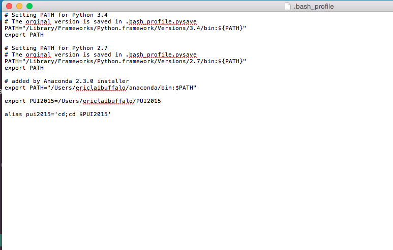
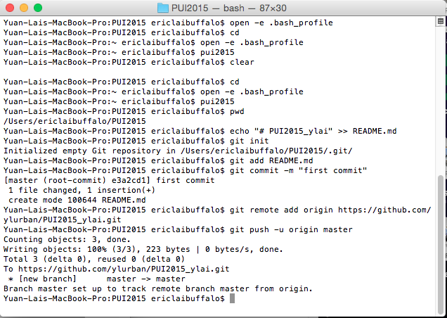

# PUI2015_ylai

Here is how I set up my environment and how that is helpful.

• I have generated a directory on your computer called PUI2015.
• Then I created an environmental variable PUI2015 that points to that directory.
• Then I created an alias in bash_profile named "pui2015" that direct me to the PUI2015 directory.

